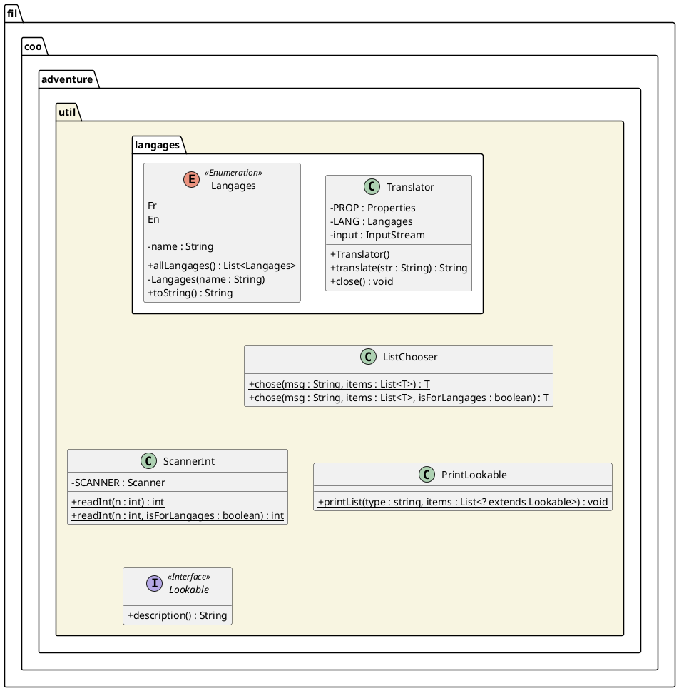
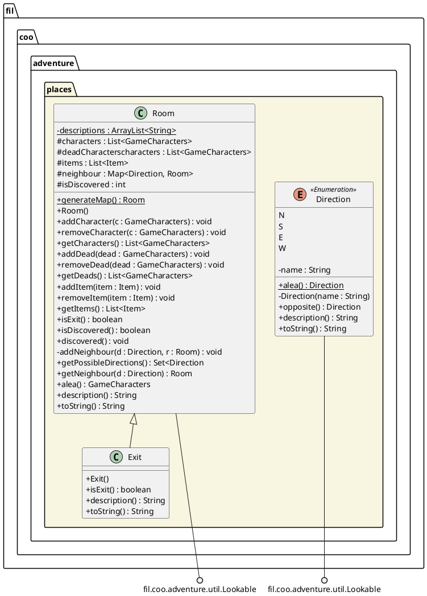
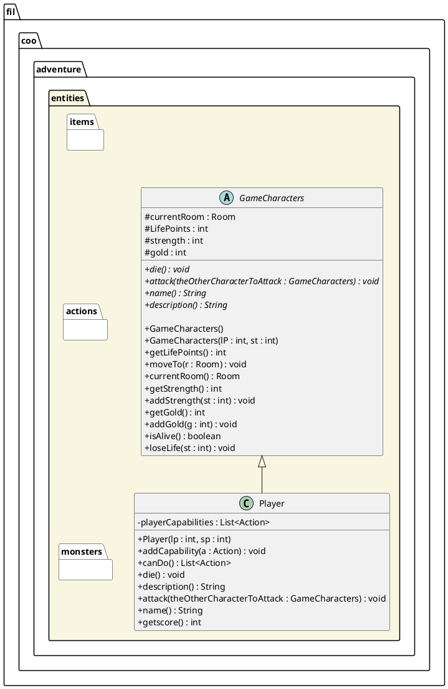
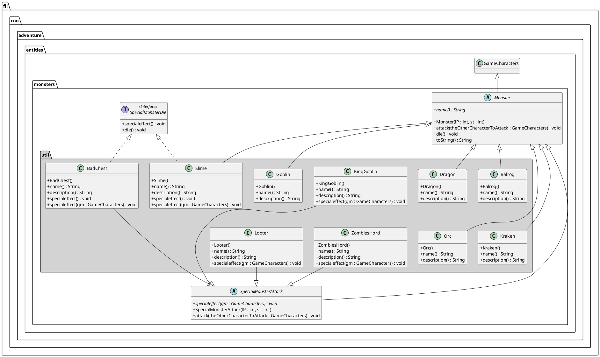

<h1 style="text-align:center">PROJET 1 - Conception Orientée Objet<br/>Donjon</h1>

<table>
<tbody>
<tr><td style="border:none" rowspan="2"></td><th style="border:none">Enseignant responsable du module:<br/>  Romain Rouvoy/Jean-Christophe Routier</th></tr>
<tr><th style="border:none">Enseignant de travaux dirigés:<br/>Jean-Christophe Routier</th></tr>
<tbody>
</table>

## Auteurs: Alexandre HULSKEN - Martin Vasilev

#### L3S5 - Gr.1

> Ce projet portait sur la conception d'un jeu style *Rogue-like*. Le langage utilisé ici a été le Java.

> Ce README permattra de vous expliquer la structure complète de ce projet ainsi que chacun des choix qui ont été fait tout au long de celui-ci. Il vous indiquera aussi comment le compiler et l'utiliser.

---

## Table des matières

1. [Introduction](#1-introduction)
2. [Utilisation](#2-utilisation)
    + [2.1. Récupération du dépôt](#2.1-recuperation-du-depot)
    + [2.2. La Documentation](#2-2-la-documentation)
    + [2.3. La Génération d'éxecutable et son Execution](#2-3-la-generation-d-executable-et-son-execution)
3. [Structure du projet](#3-structure-du-projet)
    + [2.1. Le package principal](#2.1-le-package-principal)
    + [2.2. Le package "util"](#2-2-le-package-util)
    + [2.3. Le package "entities"](#2-3-le-package-entities)
4. [Conception des Objets](#4-conception-des-objets)


---

### 1 - Introduction

Comme il a été précisé précédemment, nous avons dû concevoir un jeu de donjon dans le cadre de ce projet. Les règles de ce jeu étant simple, le joueur parcourt les différentes salles d'un donjon. Lorsqu'il arrive dans une salle, le joueur peut choisir une action à executer parmi la liste des actions possibles à ce moment là. Une salle pouvant contenir des objets et être habitée par un ou plusieurs monstres. Les objets peuvent être utilisés par le joueur. Si le joueur rencontre un monstre, il faudra alors le tuer pour pouvoir quitter la salle qu'il habite. Le monstre sera passif, mais ripostera s'il est attaqué.
L'objectif du jeu est d'atteindre une sortie du donjon, mais s'il meurt avant, le joueur sera considéré comme perdant.

---

### 2 - Utilisation

**Remarque :** Lors de la suite de l'explication qui va suivre, nous allons vous donner des commandes qui necessitent d'avoir certains programmes déjà installé sur votre machine. Nous vous conseillons donc de télécharger `Maven` et `Git`.

<br/>

##### 2.1 - Récupération du dépôt

Afin de pouvoir utiliser notre travail, vous pourrez récupérer l'ensemble de nos codes en faisant un clône de ce dépôt sur votre machine grâce à cette simple commande :

```git
$ git clone https://gitlab-etu.fil.univ-lille1.fr/vasilev/COO-projet1
```

<br/>

##### 2.2 - La Documentation

Comme il est toujours plus utile de lire la documentation d'un objet au lieu d'esssayer de comprendre son fonctionnement en lisant directement son code, vous pouvez le faire également ici. Il vous suffira uniquement de vous placer dans le dossier racine du clône que vous venez de créer et d'utiliser la commande suivante :

```bash
$ mvn javadoc:javadoc
```

Vous pourrez ensuite trouver l'ensemble de la documentation que vous venez de générer dans le dossier *./docs*.

<br/>

##### 2.3 - La Génération d'éxecutable et son Execution

Vous pouvez maintenant vous occuper de la partie la plus amusante, en vous situant dans le dossier racine de ce projet, vous pouvez le compiler et créer un éxecutable par la commande :

```bash
$ mvn package
```

A partir de là, vous pouvez lancer le jeu grâce à la commande suivante :

```bash
$ java -jar target/COO-projet1-1.0-SNAPSHOT.jar
```

<br/>

>**Remarque :** Une fois que vous aurez fini, vous pouvez nettoyer votre dossier des fichiers compilés par la commande :
>```bash
>$ mvn clean
>```

---

### 3 - Structure du projet

Lors de ce projet nous avons structuré nos codes sources selon une certaine arborescence.Comme celle-ci est assez fournis, nous allons découper notre schéma UML en plusieurs parties pour vous le présenter.

```puml
@startuml
skinparam classAttributeIconSize 0
package "fil.coo.adventure" #lightgrey/grey {
  class AdventureGame {
    + {static} TRANSLATOR : Translator
    - player : Player

    + AdventureGame(startingRoom : Room, player : Player)
    + getPlayer() : Player
    + play() : void
    - isFinished() : boolean
  }


  package "fil.coo.adventure.entities" #F8F5E1 {
    abstract class GameCharacters {
      # currentRoom : Room
      # LifePoints : int
      # strength : int
      # gold : int

      + {abstract} die() : void
      + {abstract} attack(theOtherCharacterToAttack : GameCharacters) : void
      + {abstract} name() : String
      + {abstract} description() : String

      + GameCharacters()
      + GameCharacters(lP : int, st : int)
      + getLifePoints() : int
      + moveTo(r : Room) : void
      + currentRoom() : Room
      + getStrength() : int
      + addStrength(st : int) : void
      + getGold() : int
      + addGold(g : int) : void
      + isAlive() : boolean
      + loseLife(st : int) : void
    }

    class Player {
      - playerCapabilities : List<Action>

      + Player(lp : int, sp : int)
      + addCapability(a : Action) : void
      + canDo() : List<Action>
      + die() : void
      + description() : String
      + attack(theOtherCharacterToAttack : GameCharacters) : void
      + name() : String
      + getscore() : int
    }

    package "fil.coo.adventure.entities.actions" #white {
      interface Action <<Interface>> {
        + canBeDoneIn(r : Room) : boolean
        + doneByIn(p : Player, r : Room) : void
      }

      package "fil.coo.adventure.entities.actions.util" #lightgrey {
        class AttackAction {
          + canBeDoneIn(r : Room) : boolean
          + doneByIn(p : Player, r : Room) : void
          + toString() : String
        }

        class LookAction {
          + canBeDoneIn(r : Room) : boolean
          + doneByIn(p : Player, r : Room) : void
          + toString() : String
        }

        class LootAction {
          + canBeDoneIn(r : Room) : boolean
          + doneByIn(p : Player, r : Room) : void
          + toString() : String
        }

        class MoveAction {
          + canBeDoneIn(r : Room) : boolean
          + doneByIn(p : Player, r : Room) : void
          + toString() : String
        }

        class SuicideAction {
          + canBeDoneIn(r : Room) : boolean
          + doneByIn(p : Player, r : Room) : void
          + toString() : String
        }

        class UseAction {
          + canBeDoneIn(r : Room) : boolean
          + doneByIn(p : Player, r : Room) : void
          + toString() : String
        }
      }

      together {
        class AttackAction
        class LookAction
        class LootAction
      }

      together {
        class MoveAction
        class SuicideAction
        class UseAction
      }

      SuicideAction -u[hidden]- Action

      SuicideAction -l[hidden]- MoveAction
      SuicideAction -r[hidden]- UseAction

      AttackAction -u[hidden]- MoveAction
      LookAction-u[hidden]- SuicideAction
      LootAction -u[hidden]- UseAction

      AttackAction .u.|> Action
      LookAction .u.|> Action
      LootAction .u.|> Action
      MoveAction .u.|> Action
      SuicideAction .u.|> Action
      UseAction .u.|> Action

    }


    package "fil.coo.adventure.entities.monstres" #white {
      abstract class Monster {
        + {abstract} name() : String

        + Monster(lP : int, st : int)
        + attack(theOtherCharacterToAttack : GameCharacters) : void
        + die() : void
        + toString() : String
      }

      abstract class SpecialMonsterAttack {
        + {abstract} specialeffect(gm : GameCharacters) : void
        + SpecialMonsterAttack(lP : int, st : int)
        + attack(theOtherCharacterToAttack : GameCharacters) : void
      }

      interface SpecialMonsterDie <<Interface>> {
        + specialeffect() : void
        + die() : void
      }

      package "fil.coo.adventure.entities.monstres.util" #lightgrey {
        class ZombiesHord {
          + ZombiesHord()
          + name() : String
          + description() : String
          + specialeffect(gm : GameCharacters) : void
        }

        class Slime {
          + Slime()
          + name() : String
          + description() : String
          + specialeffect() : void
          + specialeffect(gm : GameCharacters) : void
        }

        class Orc {
          + Orc()
          + name() : String
          + description() : String
        }

        class Looter {
          + Looter()
          + name() : String
          + description() : String
          + specialeffect(gm : GameCharacters) : void
        }

        class Kraken {
          + Kraken()
          + name() : String
          + description() : String
        }

        class KingGoblin {
          + KingGoblin()
          + name() : String
          + description() : String
          + specialeffect(gm : GameCharacters) : void
        }

        class Goblin {
          + Goblin()
          + name() : String
          + description() : String
        }

        class Dragon {
          + Dragon()
          + name() : String
          + description() : String
        }

        class Balrog {
          + Balrog()
          + name() : String
          + description() : String
        }

        class BadChest {
          + BadChest()
          + name() : String
          + description() : String
          + specialeffect() : void
          + specialeffect(gm : GameCharacters) : void
        }

        together {
          class Slime
          class BadChest
        }

        BadChest -l[hidden]- KingGoblin
        BadChest -d[hidden]- Looter
        KingGoblin -d[hidden]- ZombiesHord

        Kraken -u[hidden]- Balrog
        Orc -u[hidden]- Dragon
      }

      Monster -u-|> GameCharacters
      SpecialMonsterAttack -l-|> Monster
      BadChest -d-|> SpecialMonsterAttack
      BadChest .u.|> SpecialMonsterDie
      Balrog -u-|> Monster
      Dragon -u-|> Monster
      Goblin -u-|> Monster
      KingGoblin -d-|> SpecialMonsterAttack
      Kraken -u-|> Monster
      Looter -d-|> SpecialMonsterAttack
      Orc -u-|> Monster
      Slime -u-|> Monster
      Slime .u.|> SpecialMonsterDie
      ZombiesHord -d-|> SpecialMonsterAttack
    }


    package "fil.coo.adventure.entities.items" #white {
      abstract class Item {
        # currentRoom : Room

        + {abstract} isUsedBy(player : Player) : void
        + {abstract} description() : String

        + currentRoom() : Room
        + setRoom(r : Room) : r
      }

      package "fil.coo.adventure.entities.items.util" #lightgrey {
        class StrengthPotion {
          # st : int

          + isUsedBy(player : Player) : void
          + description() : String
          + toString() : String
        }

        class LifePotion {
          # lp : int

          + isUsedBy(player : Player) : void
          + description() : String
          + toString() : String
        }

        class GoldChest {
          # gold : int

          + GoldChest()
          + isUsedBy(player : Player) : void
          + name() : String
          + description() : String
          + toString() : String
        }

        class GoldStockExchange {
          + GoldStockExchange()
          + name() : String
          + description() : String
        }

        class OneArmedBandit {
          # price : int
          - {static} POSSIBLES : List<Item>

          + isUsedBy(player : Player) : void
          + description() : String
          + toString() : String
        }

        class SleepedBadChest {
          + isUsedBy(player : Player) : void
        }
      }
    }

    Item -d[hidden]- GoldChest

    LifePotion -r[hidden]- GoldChest
    GoldChest -r[hidden]- StrengthPotion
    OneArmedBandit -u[hidden]- LifePotion
    OneArmedBandit -r[hidden]- SleepedBadChest
    SleepedBadChest -r[hidden]- GoldStockExchange

    GoldChest -u-|> Item
    GoldStockExchange -u-|> GoldChest
    LifePotion -u-|> Item
    StrengthPotion -u-|> Item
    SleepedBadChest -u-|> GoldChest
    OneArmedBandit -u-|> Item
  }


  package "fil.coo.adventure.places" #F8F5E1 {
    enum Direction <<Enumeration>> {
      N
      S
      E
      W

      - name : String

      + {static} alea() : Direction
      - Direction(name : String)
      + opposite() : Direction
      + description() : String
      + toString() : String
    }

    class Room {
      - {static} descriptions : ArrayList<String>
      # characters : List<GameCharacters>
      # deadCharacterscharacters : List<GameCharacters>
      # items : List<Item>
      # neighbour : Map<Direction, Room>
      # isDiscovered : int

      + {static} generateMap() : Room
      + Room()
      + addCharacter(c : GameCharacters) : void
      + removeCharacter(c : GameCharacters) : void
      + getCharacters() : List<GameCharacters>
      + addDead(dead : GameCharacters) : void
      + removeDead(dead : GameCharacters) : void
      + getDeads() : List<GameCharacters>
      + addItem(item : Item) : void
      + removeItem(item : Item) : void
      + getItems() : List<Item>
      + isExit() : boolean
      + isDiscovered() : boolean
      + discovered() : void
      - addNeighbour(d : Direction, r : Room) : void
      + getPossibleDirections() : Set<Direction
      + getNeighbour(d : Direction) : Room
      + alea() : GameCharacters
      + description() : String
      + toString() : String
    }

    class Exit {
      + Exit()
      + isExit() : boolean
      + description() : String
      + toString() : String
    }
  }


  package "fil.coo.adventure.util" #F8F5E1 {
    interface Lookable <<Interface>> {
      + description() : String
    }

    class ListChooser {
      + {static} chose(msg : String, items : List<T>) : T
      + {static} chose(msg : String, items : List<T>, isForLangages : boolean) : T
    }

    class ScannerInt {
      - {static} SCANNER : Scanner

      + {static} readInt(n : int) : int
      + {static} readInt(n : int, isForLangages : boolean) : int
    }

    class PrintLookable {
      + {static} printList(type : string, items : List<? extends Lookable>) : void
    }

    ListChooser -d[hidden]- ScannerInt
    PrintLookable -u[hidden]- ListChooser
    Lookable -u[hidden]- ScannerInt

    package "fil.coo.adventure.util.langages" #white {
      enum Langages <<Enumeration>> {
        Fr
        En

        - name : String

        + {static} allLangages() : List<Langages>
        - Langages(name : String)
        + toString() : String
      }

      class Translator {
        - PROP : Properties
        - LANG : Langages
        - input : InputStream

        + Translator()
        + translate(str : String) : String
        + close() : void
      }

      ListChooser -u[hidden]- Translator
    }
  }

  Item .|> Lookable
  Room .|> Lookable
  Direction .r.|> Lookable
  GameCharacters .u.|> Lookable
  Exit -u-|> Room
  Player -r-|> GameCharacters
}
@enduml
```



Afin de vous rendre ce diagramme plus facile à lire nous allons le décomposer ensemble pour en voir son intégralité.

##### 3.1 - Le package principal


```puml
skinparam classAttributeIconSize 0
package fil.coo.adventure #lightgrey/grey {
  class AdventureGame {
    + {static} TRANSLATOR : Translator
    - player : Player

    + AdventureGame(startingRoom : Room, player : Player)
    + getPlayer() : Player
    + play() : void
    - isFinished() : boolean
  }

  package fil.coo.adventure.util {

  }

  package fil.coo.adventure.entities {

  }

  package fil.coo.adventure.places {

  }

  note as N1
    Le package <b>fil.coo.adventure.places</b>:
        -> il nous a servit à mettre l'ensemble des
        objets en rapport avec des endroits du donjon.
    Le package <b>fil.coo.adventure.entities</b>:
        -> Nous y avons implémenté l'ensemble des
        objets physique (<i>ex: les personnages, objet...</i>)
        et ce qui leur est utile (<i>les actions</i>).
    Le package <b>fil.coo.adventure.util</b>:
        -> Il contient l'ensemble des objets qui nous
        ont été util lors de l'implémentation mais qui
        n'apparaissent pas physiquement dans le donjon
  end note

  AdventureGame -d[hidden]- fil.coo.adventure.util
  fil.coo.adventure.places -r[hidden]- fil.coo.adventure.entities
  fil.coo.adventure.places -l[hidden]- fil.coo.adventure.util
}
```

##### 3.2 - Le package "util"




##### 3.2 - Le package "places"




##### 3.3 - Le package "entities"




Comme vous pouvez le voir ci-dessus, ce package est imposant, c'est pourquoi nous avons encore fait le choix de décomposer notre diagramme en trois autres parties :

+ **<em style="text-decoration:underline">Les actions</em> :**

  > 

    >>>
    ```puml
    @startuml
    skinparam classAttributeIconSize 0
    package "fil.coo.adventure.entities.actions" #white {
      interface Action <<Interface>> {
        + canBeDoneIn(r : Room) : boolean
        + doneByIn(p : Player, r : Room) : void
      }

      package "fil.coo.adventure.entities.actions.util" #lightgrey {
        class AttackAction {
          + canBeDoneIn(r : Room) : boolean
          + doneByIn(p : Player, r : Room) : void
          + toString() : String
        }

        class LookAction {
          + canBeDoneIn(r : Room) : boolean
          + doneByIn(p : Player, r : Room) : void
          + toString() : String
        }

        class LootAction {
          + canBeDoneIn(r : Room) : boolean
          + doneByIn(p : Player, r : Room) : void
          + toString() : String
        }

        class MoveAction {
          + canBeDoneIn(r : Room) : boolean
          + doneByIn(p : Player, r : Room) : void
          + toString() : String
        }

        class SuicideAction {
          + canBeDoneIn(r : Room) : boolean
          + doneByIn(p : Player, r : Room) : void
          + toString() : String
        }

        class UseAction {
          + canBeDoneIn(r : Room) : boolean
          + doneByIn(p : Player, r : Room) : void
          + toString() : String
        }
      }

      together {
        class AttackAction
        class LookAction
        class LootAction
      }

      together {
        class MoveAction
        class SuicideAction
        class UseAction
      }

      SuicideAction -u[hidden]- Action

      SuicideAction -l[hidden]- MoveAction
      SuicideAction -r[hidden]- UseAction

      AttackAction -u[hidden]- MoveAction
      LookAction-u[hidden]- SuicideAction
      LootAction -u[hidden]- UseAction

      AttackAction .u.|> Action
      LookAction .u.|> Action
      LootAction .u.|> Action
      MoveAction .u.|> Action
      SuicideAction .u.|> Action
      UseAction .u.|> Action
    }
    @enduml
    ```
    >>>

+ **<em style="text-decoration:underline">Les objets</em> :**

  > 

    >>>
    ```puml
    @startuml
    skinparam classAttributeIconSize 0
    package "fil.coo.adventure.entities.items" #white {
      abstract class Item {
        # currentRoom : Room

        + {abstract} isUsedBy(player : Player) : void
        + {abstract} description() : String

        + currentRoom() : Room
        + setRoom(r : Room) : r
      }

      package "fil.coo.adventure.entities.items.util" #lightgrey {
        class StrengthPotion {
          # st : int

          + isUsedBy(player : Player) : void
          + description() : String
          + toString() : String
        }

        class LifePotion {
          # lp : int

          + isUsedBy(player : Player) : void
          + description() : String
          + toString() : String
        }

        class GoldChest {
          # gold : int

          + GoldChest()
          + isUsedBy(player : Player) : void
          + name() : String
          + description() : String
          + toString() : String
        }

        class GoldStockExchange {
          + GoldStockExchange()
          + name() : String
          + description() : String
        }

        class OneArmedBandit {
          # price : int
          - {static} POSSIBLES : List<Item>

          + isUsedBy(player : Player) : void
          + description() : String
          + toString() : String
        }

        class SleepedBadChest {
          + isUsedBy(player : Player) : void
        }
      }
    }

    Item -d[hidden]- GoldChest
    Item ....() fil.coo.adventure.util.Lookable

    LifePotion -r[hidden]- GoldChest
    GoldChest -r[hidden]- StrengthPotion
    OneArmedBandit -u[hidden]- LifePotion
    OneArmedBandit -r[hidden]- SleepedBadChest
    SleepedBadChest -r[hidden]- GoldStockExchange

    GoldChest -u-|> Item
    GoldStockExchange -u-|> GoldChest
    LifePotion -u-|> Item
    StrengthPotion -u-|> Item
    SleepedBadChest -u-|> GoldChest
    OneArmedBandit -u-|> Item

    @enduml
    ```
    >>>

+ **<em style="text-decoration:underline">Les monstres</em> :**

  > 



### 4 - Conception des Objet
